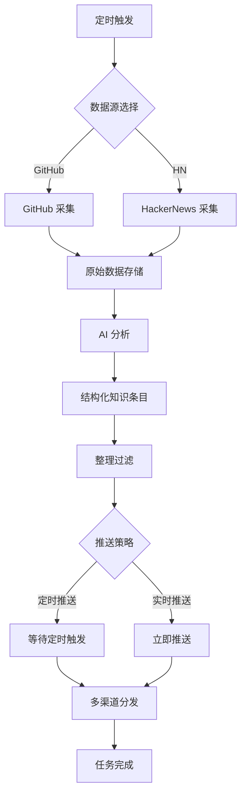

# AI 知识库助手 · Agent 架构设计文档

## 概述

本系统通过多 Agent 协作，自动从 GitHub Trending 和 Hacker News 采集 AI/LLM/Agent 领域的技术动态，经 AI 分析后结构化存储为 JSON 知识条目，并支持多渠道（Telegram/飞书）分发，为用户提供实时、高质量的技术情报。

## 技术栈

- **编程语言**: Python 3.12
- **Agent 框架**: OpenCode + 国产大模型 (DeepSeek/Qwen)
- **工作流编排**: LangGraph
- **数据抓取**: OpenClaw (基于 Playwright/httpx)
- **数据存储**: JSON 文件 + SQLite (可选)
- **消息推送**: Telegram Bot API、飞书开放平台

## 编码规范

### 通用规范
- **代码风格**: Python遵循PEP 8，使用`black`自动格式化；TypeScript使用`strict`模式，ESLint检查
- **命名约定**: Python变量/函数使用`snake_case`，类使用`CamelCase`；TypeScript遵循相应语言约定
- **文档字符串**: 所有公开函数（跨模块使用）必须有Google风格docstring，包含参数、返回值和示例
- **常量定义**: 禁止魔法字符串，所有业务逻辑常量必须定义为模块级变量或配置
- **日志记录**: 统一使用`logging`模块，禁止裸`print()`输出
- **类型注解**: 尽可能使用类型注解，提高代码可读性
- **异常处理**: 明确捕获特定异常，避免裸露的`except:`
- **提交要求**: 禁止`TODO`注释提交到`main`分支

### 测试与质量
- **测试覆盖**: Python单元测试覆盖率≥80%，使用`pytest-cov`测量
- **CI流程**: 每个PR必须通过CI检查，自动运行lint（black, ESLint）和单测
- **代码审查**: 所有更改需经过代码审查，确保符合规范

## 项目结构

```
.
├── .opencode/
│   ├── agents/           # Agent 定义文件
│   │   ├── collector.py
│   │   ├── analyzer.py
│   │   └── distributor.py
│   └── skills/          # 可复用的技能模块
│       ├── web_scraper.py
│       ├── llm_client.py
│       └── notifier.py
├── knowledge/
│   ├── raw/             # 原始采集数据 (JSON)
│   │   ├── github/
│   │   └── hackernews/
│   └── articles/        # 结构化知识条目 (JSON)
│       └── YYYY-MM-DD.json
├── config.yaml          # 配置文件
├── requirements.txt     # Python 依赖
└── README.md
```

## 知识条目 JSON 格式

每个知识条目代表一个 AI 相关技术动态，包含以下字段：

```json
{
  "id": "github_openai_gpt-3_2025-04-17",
  "title": "OpenAI 发布 GPT-3 模型",
  "source": "github",  // 或 "hackernews"
  "source_url": "https://github.com/openai/gpt-3",
  "published_at": "2025-04-17T00:00:00Z",
  "summary": "OpenAI 发布的大规模预训练语言模型 GPT-3，具有 1750 亿参数...",
  "content": "详细分析内容，由 AI 生成...",
  "tags": ["llm", "language-model", "openai"],
  "category": "模型发布",  // 模型发布、工具库、论文、行业动态等
  "status": "published",  // draft, published, archived
  "metadata": {
    "stars": 50000,
    "language": "Python",
    "author": "openai",
    "hackernews_score": 256
  },
  "created_at": "2025-04-17T10:30:00Z",
  "updated_at": "2025-04-17T10:30:00Z"
}
```

**字段说明**:
- `id`: 唯一标识符，格式为 `{source}_{slug}_{date}`
- `title`: 条目标题，从源信息提取或 AI 生成
- `source`: 数据源，`github` 或 `hackernews`
- `source_url`: 原始链接
- `published_at`: 源发布时间 (UTC)
- `summary`: AI 生成的摘要 (100-200字)
- `content`: 详细分析内容 (可选)
- `tags`: 标签列表，用于分类检索
- `category`: 分类，便于聚合展示
- `status`: 状态机，控制发布流程
- `metadata`: 源平台特定元数据
- `created_at`/`updated_at`: 系统内部时间戳

## Agent 角色概览

| 角色 | 职责 | 输入 | 输出 | 关键技术 |
|------|------|------|------|----------|
| **采集 Agent** | 从 GitHub Trending 和 Hacker News 抓取原始数据 | 定时触发 | 原始数据列表 (JSON) | OpenClaw, GitHub API, RSS |
| **分析 Agent** | AI 分析原始数据，生成结构化知识条目 | 原始数据列表 | 结构化知识条目 (JSON) | DeepSeek API, 提示工程 |
| **整理 Agent** | 过滤、去重、分类、打标签，并推送到 Telegram/飞书 | 结构化知识条目 | 推送状态 + 整理后的知识条目 | 规则引擎, 相似度计算, Bot API |

### 1. 采集 Agent (Collector)

**数据源**:
- **GitHub Trending**: 每日 Top 50 项目，通过 GitHub REST API 或网页抓取
- **Hacker News**: Top 30 故事，通过官方 API 或 RSS

**采集频率**:
- GitHub Trending: 每日 UTC 00:00
- Hacker News: 每日 UTC 00:00

**输出格式**:
```json
[
  {
    "platform": "github",
    "title": "openai/gpt-3",
    "url": "https://github.com/openai/gpt-3",
    "description": "GPT-3 language model",
    "metadata": {
      "stars": 50000,
      "language": "Python",
      "topics": ["ai", "llm"]
    },
    "collected_at": "2025-04-17T00:00:00Z"
  }
]
```

### 2. 分析 Agent (Analyzer)

**AI 分析维度**:
1. **相关性判断**: 是否属于 AI/LLM/Agent 领域
2. **摘要生成**: 用 100-200 字概括核心内容
3. **标签提取**: 自动提取 3-5 个相关标签
4. **分类判断**: 模型发布、工具库、论文、行业动态等
5. **质量评估**: 技术价值、创新性、实用性评分

**提示工程优化**:
- 使用少量示例 (few-shot) 提高准确性
- 结构化输出约束为 JSON 格式
- 成本控制: 每个条目 token 上限 2000

### 3. 整理 Agent (Curator)

**主要功能**:
1. **去重**: 基于标题、URL 相似度检测重复条目
2. **过滤**: 根据质量评分和相关性阈值过滤低质量条目
3. **分类**: 按预设分类体系自动归类
4. **标签增强**: 合并相似标签，补充缺失标签
5. **状态管理**: 管理条目的 `draft` → `published` → `archived` 生命周期

**推送功能**:
- **推送渠道**:
  - **Telegram**: 每日摘要频道，实时推送重要动态
  - **飞书**: 团队知识库同步，支持 @提及 特定成员
- **推送策略**:
  - **定时推送**: 每日 UTC 08:00 发送前 24 小时重要动态
  - **实时推送**: 高价值条目 (评分 > 8.0) 立即推送
  - **摘要格式**: Markdown，包含标题、摘要、标签和原始链接


## 红线 (绝对禁止的操作)

1. **数据安全**
   - 禁止在代码中硬编码 API 密钥、令牌等敏感信息
   - 禁止将原始用户数据上传至第三方服务
   - 禁止存储未经脱敏的个人身份信息 (PII)

2. **API 使用**
   - 禁止违反平台 Rate Limit 规定 (GitHub/HackerNews/飞书/Telegram)
   - 禁止绕过付费 API 限制
   - 禁止将 API 密钥分享给未授权方

3. **内容合规**
   - 禁止采集、存储、传播违法、违规内容
   - 禁止 AI 生成有害、歧视性、虚假信息
   - 禁止未经授权转载受版权保护的内容

4. **系统稳定性**
   - 禁止无限循环或未设置超时的网络请求
   - 禁止未处理异常导致 Agent 进程崩溃
   - 禁止同时启动过多并发请求导致服务过载

5. **成本控制**
   - 禁止单日 LLM API 调用超出 $0.5 预算
   - 禁止无限制存储原始数据，需定期清理
   - 禁止推送频率超出渠道限制 (如 Telegram 频道的消息频率限制)

## 执行流程



## 监控与维护

### 健康检查
- **采集成功率**: 目标 > 95%
- **分析准确率**: 定期人工抽样评估
- **推送到达率**: 监控渠道反馈

### 日志记录
- 所有 Agent 操作记录到结构化日志文件
- 关键事件 (错误、限流、成本超支) 发送警报
- 日志保留 30 天

### 成本监控
- 每日 LLM API 消耗图表
- 月度预算与实际支出对比
- 成本超支自动暂停机制

## 扩展规划

### 短期 (1-3 个月)
- 增加 arXiv、Twitter 作为数据源
- 支持更多推送渠道 (微信、Discord)
- 实现 Web 界面查看知识库

### 中期 (3-6 个月)
- 添加用户反馈机制 (有用/无用评分)
- 实现个性化推荐
- 支持知识图谱构建

### 长期 (6-12 个月)
- 开源 Agent 框架
- 提供 SaaS 服务
- 建立 AI 技术动态标准数据集

## 附录

### 环境变量配置
```bash
# API 密钥
GITHUB_TOKEN=
DEEPSEEK_API_KEY=
TELEGRAM_BOT_TOKEN=
FEISHU_WEBHOOK_URL=

# 配置参数
MAX_DAILY_BUDGET=0.5
REQUEST_TIMEOUT=30
LOG_LEVEL=INFO
```

### 快速开始
1. 克隆仓库并安装依赖: `pip install -r requirements.txt`
2. 配置环境变量: 复制 `.env.example` 到 `.env` 并填写
3. 启动 Agent 系统: `python main.py`
4. 查看生成的知识条目: `ls knowledge/articles/`

### 故障排除
- **采集失败**: 检查网络连接和 API 令牌
- **分析超时**: 降低每个条目的 token 上限
- **推送失败**: 验证渠道令牌和网络可达性
```

（文档结束）