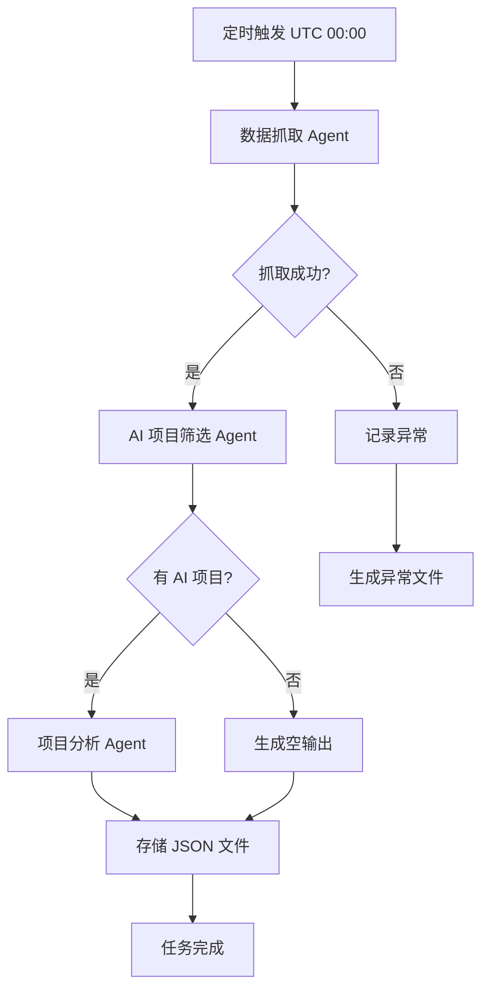

# AI 知识库 · Agent 设计文档

## 概述

本系统通过多个 Agent 协作，自动抓取 GitHub Trending 榜单中的 AI 相关项目并提取结构化信息。每日 UTC 00:00:00 执行一次，生成 JSON 格式的知识库文章。

## Agent 定义

### 1. 数据抓取 Agent (Data Fetcher Agent)

**职责**：从 GitHub Trending 获取每日 Top 50 项目列表。

**输入**：无（定时触发）
**输出**：原始项目列表，包含：
- 仓库名 (name)
- 仓库链接 (url)
- 作者 (author)
- 描述 (description)
- 语言 (language)
- 星标数 (stars)
- 今日新增星标数 (stars_today)
- 话题标签 (topics)
- 其他元数据

**实现要点**：
- 使用 GitHub REST API 或网页抓取（若 API 无 trending 端点）
- 处理网络超时、限流等异常
- 输出临时数据供后续 Agent 使用

**边界**：
- 仅抓取 Top 50，不处理历史数据
- 每日仅执行一次，失败时重试最多 3 次（仅限网络错误）

### 2. AI 项目筛选 Agent (AI Project Filter Agent)

**职责**：使用 NLP 模型判断项目是否与 AI 相关。

**输入**：数据抓取 Agent 输出的原始项目列表
**输出**：AI 相关项目子集

**判断依据**：
- 项目 topics 包含 AI 相关关键词（如 "ai", "machine-learning", "llm", "deep-learning" 等）
- 项目 name 或 description 包含 AI 相关术语
- 可扩展：检查 README 内容（需谨慎控制 token 成本）

**实现要点**：
- 使用轻量级 NLP 模型（如关键词匹配 + 嵌入相似度）
- 通过 DeepSeek API 进行文本分类（若关键词匹配不明确）
- 输出为过滤后的项目列表，标记为 AI 相关

**边界**：
- 成本控制：优先使用规则匹配，仅在不明确时调用模型
- 不进行深度评估，仅做二元分类（是/否 AI 相关）

### 3. 项目分析 Agent (Project Analysis Agent)

**职责**：对每个 AI 相关项目进行多维分析，提取结构化信息。

**输入**：AI 项目筛选 Agent 输出的项目列表
**输出**：结构化 JSON 数组，每个项目包含以下字段：

| 字段名 | 类型 | 说明 | 是否必需 |
|--------|------|------|----------|
| id | string | 唯一标识（可采用 UUID 或 repo_name + trending_date 组合） | 是 |
| repo_name | string | 仓库名（如 "openai/gpt-3"） | 是 |
| repo_url | string | 仓库链接 | 是 |
| trending_date | string | 上榜日期，YYYY-MM-DD 格式（UTC） | 是 |
| summary | string | 项目简介，由模型生成 | 是 |
| core_features | array | 核心功能列表，允许空数组 | 是 |
| tech_stack | array | 技术栈列表，允许空数组 | 是 |
| innovation | string/null | 创新点描述，可选 | 否 |
| use_cases | array | 适用场景列表，允许空数组 | 是 |

**实现要点**：
- 调用 DeepSeek API 分析项目（使用 repo 的 description、topics、README 片段）
- 设计 prompt 工程，确保输出结构化 JSON
- 批量处理以提高效率，注意 token 成本
- 错误处理：单个项目分析失败不应影响整体任务，记录异常继续处理下一个

**边界**：
- 仅进行基础维度分析，不进行代码深度评估
- 每个项目分析 token 上限可设定（如 2000 tokens）
- 字段灵活，允许空数组或 null 值

## 执行流程



1. **定时触发**：每日 UTC 00:00:00 启动流程
2. **数据抓取**：获取 GitHub Trending Top 50
3. **AI 筛选**：过滤出 AI 相关项目
4. **项目分析**：对每个 AI 项目提取结构化信息
5. **存储结果**：
   - 成功：`knowledge/articles/YYYY-MM-DD.md`（纯 JSON 数组）
   - 失败：`knowledge/incidents/YYYY-MM-DD.md`（错误详情）
6. **清理旧数据**：自动保留最近 30 天数据，旧数据可归档或删除

## 数据存储

### 输出文件结构

```
knowledge/
├── articles/
│   ├── 2025-04-17.md   # JSON 数组
│   ├── 2025-04-18.md
│   └── ...
└── incidents/
    ├── 2025-04-17.md   # 异常信息
    └── ...
```

**文件格式示例** (`knowledge/articles/2025-04-17.md`):
```json
[
  {
    "id": "openai_gpt-3_2025-04-17",
    "repo_name": "openai/gpt-3",
    "repo_url": "https://github.com/openai/gpt-3",
    "trending_date": "2025-04-17",
    "summary": "OpenAI 的 GPT-3 语言模型...",
    "core_features": ["文本生成", "代码补全", "对话系统"],
    "tech_stack": ["Python", "PyTorch", "TensorFlow"],
    "innovation": "大规模预训练 Transformer 模型",
    "use_cases": ["聊天机器人", "内容创作", "编程辅助"]
  },
  // ... 更多项目
]
```

### 数据保留策略
- 最近 30 天数据保留在 `knowledge/articles/`
- 30 天前的数据可自动移动到归档目录或删除
- 异常文件永久保留（或定期清理）

## 异常处理

### 异常类型
1. **网络错误**：GitHub API 不可达、超时
2. **API 限流**：GitHub API 或 DeepSeek API 限流
3. **解析错误**：HTML/JSON 解析失败
4. **模型错误**：DeepSeek API 返回异常
5. **存储错误**：文件写入失败

### 处理策略
- **网络错误**：自动重试最多 3 次，每次间隔指数退避
- **API 限流**：等待后重试，若持续限流则记录异常并终止当日任务
- **解析错误**：记录异常，跳过当前项目继续处理
- **模型错误**：记录异常，跳过当前项目继续处理
- **存储错误**：重试 2 次，若仍失败则记录异常

### 异常文件格式
`knowledge/incidents/YYYY-MM-DD.md` 包含：
- 异常时间戳
- 异常类型
- 错误详情
- 受影响的步骤（抓取、筛选、分析、存储）
- 建议处理措施

## 配置管理

### 环境变量
```bash
# GitHub API 配置（可选 token 用于提高限流）
GITHUB_TOKEN=

# DeepSeek API 配置
DEEPSEEK_API_KEY=
DEEPSEEK_BASE_URL=https://api.deepseek.com

# 执行配置
MAX_RETRIES=3
REQUEST_TIMEOUT=30
DAILY_TOKEN_BUDGET=0.5  # 美元
```

### 配置文件
`config.yaml`（可选）：
```yaml
github:
  trending_url: "https://github.com/trending"
  api_base: "https://api.github.com"
  timeout: 30
  
deepseek:
  model: "deepseek-chat"
  max_tokens_per_project: 2000
  temperature: 0.2
  
storage:
  articles_dir: "knowledge/articles"
  incidents_dir: "knowledge/incidents"
  retention_days: 30
  
logging:
  level: "INFO"
  file: "logs/execution.log"
```

## 成本控制

### 预算分配
- 每日总预算：$0.5
- 分配建议：
  - AI 筛选：≤ $0.1（优先使用规则匹配）
  - 项目分析：≤ $0.4（约 20-30 个项目，每个项目 ≤ $0.02）

### 优化措施
1. **缓存机制**：相同 repo 在不同日期 trending 时可复用部分分析结果
2. **批量请求**：将多个项目分析合并到单个 API 调用（若 API 支持）
3. **截断文本**：限制输入 token 数量（如只取 README 前 1000 字符）
4. **降级策略**：成本接近预算时，跳过非核心字段（如 innovation）

## 监控与验证

### 执行状态监控
- **成功标准**：`knowledge/articles/YYYY-MM-DD.md` 文件存在且包含有效 JSON
- **失败标准**：`knowledge/incidents/YYYY-MM-DD.md` 文件存在
- **监控方式**：检查每日生成的文件，可集成外部监控（如 Cronitor、Healthchecks）

### 质量抽查
- 定期手动检查分析结果的合理性
- 验证 AI 筛选的准确性（抽查 false positive/negative）
- 检查 JSON 格式有效性

### 性能指标
- 任务执行成功率（目标：月成功率 ≥ 95%）
- 平均执行时间（目标：< 10 分钟）
- 异常发生频率
- 每日 token 消耗（目标：< $0.5）

## 部署考虑

### 运行环境要求
- Python 3.9+
- 网络访问（GitHub API、DeepSeek API）
- 文件系统写入权限
- 定时任务调度器（如 cron、systemd timer）

### 部署选项
1. **本地脚本**：最简单，适合个人使用
2. **云函数**（AWS Lambda、Google Cloud Functions）：无服务器，自动伸缩
3. **容器化**（Docker + Kubernetes）：适合团队部署
4. **CI/CD 集成**：通过 GitHub Actions 每日执行

### 扩展性
当前设计为最小可行产品，未来可扩展：
- 增加数据源（Hacker News、arXiv、博客）
- 增加分析维度（代码质量、社区活跃度、许可证）
- 提供 API 服务或 UI 界面
- 支持多语言（中文、英文分析）

## 附录

### Prompt 设计示例

**AI 项目筛选 Prompt**：
```
判断以下 GitHub 项目是否与人工智能（AI、机器学习、深度学习、自然语言处理、计算机视觉等）相关。

项目信息：
名称：{name}
描述：{description}
话题标签：{topics}

请仅回答 "是" 或 "否"。
```

**项目分析 Prompt**：
```
请分析以下 GitHub 项目，提取结构化信息：

项目名称：{repo_name}
描述：{description}
话题标签：{topics}
README 片段：{readme_snippet}

请以 JSON 格式返回以下字段：
- summary: 项目简介（100-200字）
- core_features: 核心功能列表（数组）
- tech_stack: 技术栈列表（数组）
- innovation: 创新点描述（可选，如无显著创新可留空）
- use_cases: 适用场景列表（数组）

JSON 格式要求严格，仅返回 JSON 对象，不要有其他文本。
```

### 参考链接
- GitHub Trending: https://github.com/trending
- DeepSeek API 文档: https://platform.deepseek.com/api-docs
- 项目愿景文档: spec/project-vision.md
```

（文档结束）