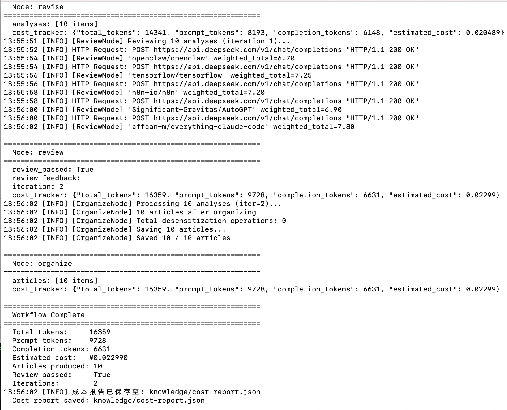
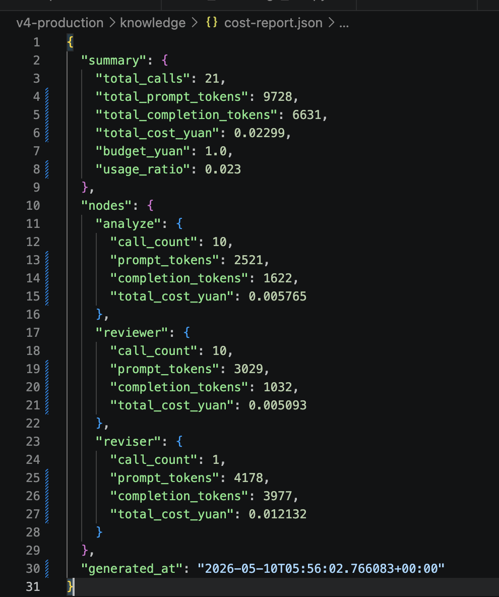
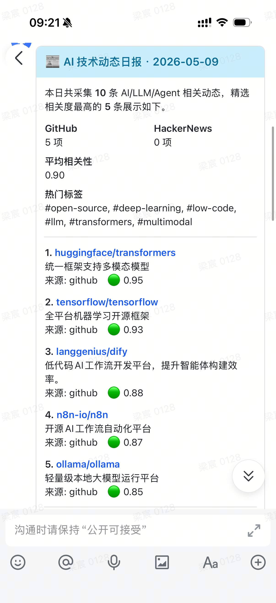
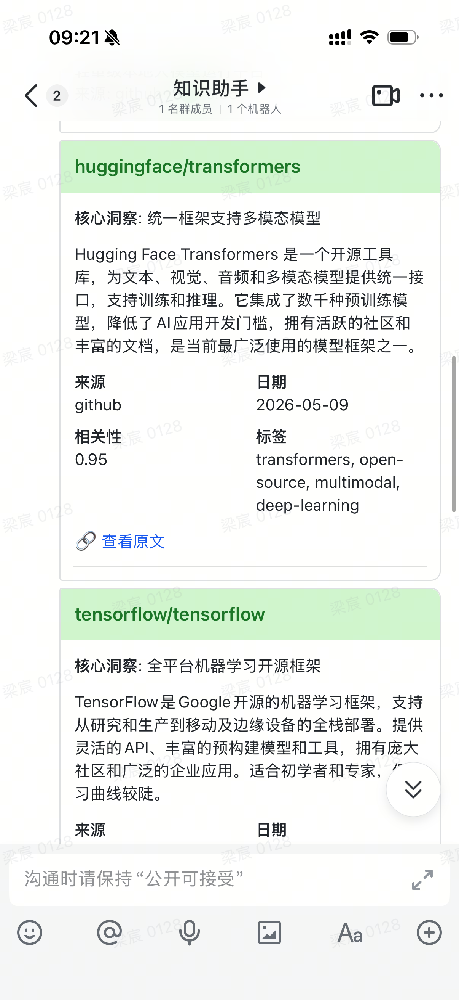

# AI 知识库系统

基于多 Agent 协作的 AI 技术知识库——自动采集、智能分析、定时推送。

## 架构概览

```
┌─────────────────────────────────────────────────────────────────┐
│                         Agent 层                                │
│   Collector (采集)  →  Analyzer (分析)  →  Organizer (整理)     │
│         │                   │                    │              │
│    意图路由 + 成本守卫    Planner 策略     Reviewer 质量审核     │
├─────────────────────────────────────────────────────────────────┤
│                        Pipeline 层                              │
│   model_client.py  │  pipeline.py  │  rss_sources.yaml          │
│     LLM 抽象层        4 步流水线        RSS 源配置              │
├─────────────────────────────────────────────────────────────────┤
│                        工程层                                    │
│   LangGraph 工作流  │  GitHub Actions CI  │  PII 脱敏  │  CostGuard │
│   7 节点状态图        每日定时 cron        安全过滤      预算控制  │
├─────────────────────────────────────────────────────────────────┤
│                        分发层                                    │
│   Telegram Bot  ←  KnowledgeBot  →  飞书开放平台                 │
│   (MarkdownV2)       搜索/订阅/权限      (交互式卡片)             │
└─────────────────────────────────────────────────────────────────┘
```

## 快速开始

```bash
# 1. 克隆项目
git clone https://github.com/DanielHHP/my-ai-knowledge-base.git
cd my-ai-knowledge-base/v4-production

# 2. 配置环境变量
cp .env.example .env
# 编辑 .env，填入 LLM API Key、Telegram Bot Token 等

# 3. 启动服务
docker compose up -d
```

> 若无 Docker 环境，也可直接运行：
> ```bash
> pip install -r requirements.txt
> python -m workflows.graph --sources github,rss
> ```

## 目录结构

| 目录 | 说明 | 版本 |
|------|------|------|
| `v1-skeleton/` | 概念原型：Agent 角色定义、知识库规范、手动创建 | V1 |
| `v2-automation/` | 自动化 Pipeline：LLM 客户端、RSS 采集、质量钩子 | V2 |
| `v3-multi-agent/` | 多 Agent 协作：LangGraph 编排、CI 定时、Review/Reviser 循环 | V3 |
| `v4-production/` | 生产环境：KnowledgeBot 聊天、Telegram/飞书分发、PII 脱敏 | V4 |
| `workflows/` | LangGraph 工作流：state / graph / collector / analyzer / organizer | V3+ |
| `pipeline/` | CLI 流水线：模型客户端、RSS 源配置 | V2+ |
| `patterns/` | 设计模式：Router（意图路由）、Supervisor（质量审核） | V3+ |
| `bot/` | KnowledgeBot 聊天机器人：搜索、订阅、权限管理 | V4 |
| `distribution/` | 分发层：Markdown / Telegram / 飞书消息格式化与推送 | V4 |
| `tests/` | 测试套件：注入检测、PII 过滤、格式化验证、成本守卫 | V3+ |
| `.opencode/` | OpenCode 配置：Agent / Skill 定义文件 | V1+ |
| `.github/workflows/` | GitHub Actions CI：每日定时采集 | V3 |

## 技术栈

| 类别 | 技术 |
|------|------|
| Agent 框架 | OpenCode |
| 工作流编排 | LangGraph |
| 大语言模型 | DeepSeek / Qwen / OpenAI 兼容 |
| 容器化 | Docker + Docker Compose |
| 消息推送 | Telegram Bot API、飞书开放平台 |
| 异步 HTTP | aiohttp / httpx |
| CI/CD | GitHub Actions |
| 语言 | Python 3.12 |

## 版本历史

### V1 — 概念骨架
- Agent 角色定义（Collector / Analyzer / Organizer）
- 知识条目 JSON Schema 规范
- 手动创建知识库条目

### V2 — 自动化 Pipeline
- Python CLI 流水线（`pipeline.py`）
- LLM 客户端抽象层（DeepSeek / Qwen / OpenAI）
- RSS 多源采集（Hacker News / arXiv / 技术博客）
- Git Hooks 质量校验

### V3 — 多 Agent 协作
- LangGraph 7 节点状态图编排
- Planner 三级策略（Lite / Standard / Full）
- Reviewer → Reviser 自动质量反馈循环
- Human Flag 人工兜底机制
- GitHub Actions 每日定时执行

### V4 — 生产就绪
- KnowledgeBot 聊天机器人（搜索 / 订阅 / 权限）
- 异步 Telegram / 飞书多渠道分发
- PII 隐私脱敏 & Prompt 注入防御
- CostGuard 成本预算控制
- OpenClaw Agent 身份系统

## 月度成本估算

| 项目 | 单价 | 月度用量 | 月费用 |
|------|------|----------|--------|
| DeepSeek-V3 API | ¥1 / 1M tokens | ~5M tokens | ¥5 |
| GitHub Actions | 免费额度内 | ~30 次运行 | ¥0 |
| 轻量云服务器 | ¥50-80 / 月 | 1 台 | ¥50-80 |
| Telegram Bot | 免费 | — | ¥0 |
| **合计** | | | **¥55-85 / 月** |

> 若使用 Qwen 免费 API 搭配本地计算资源运行，成本可降至 ¥0。


## License

MIT License

Copyright (c) 2026


## 运行情况

### workflow执行





### 飞书消息推送






